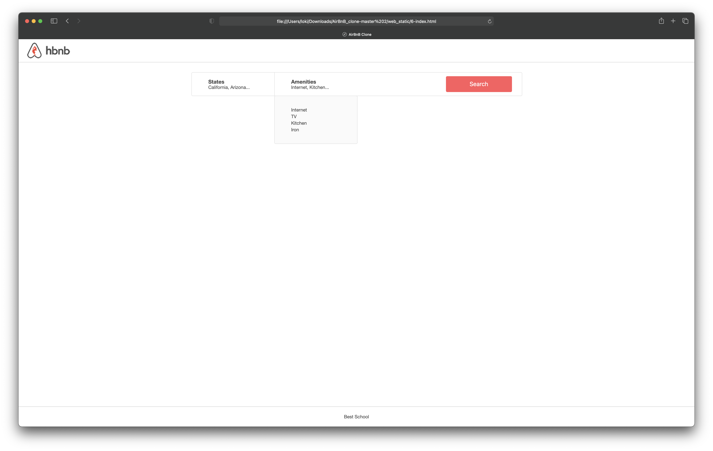

<h1>0x01. AirBnB clone - Web static</h1>

<h1>Background Context</h1>
<h2>Web static, what?</h2>

Now that you have a command interpreter for managing your AirBnB objects, it’s time to make them alive!

Before developing a big and complex web application, we will build the front end step-by-step.

The first step is to “design” / “sketch” / “prototype” each element:

<li>Create simple HTML static pages</li>
<li>Style guide</li>
<li>Fake contents</li>
<li>No Javascript</li>
<li>No data loaded from anything</li>
 

During this project, you will learn how to manipulate HTML and CSS languages. HTML is the structure of your page, it should be the first thing to write. CSS is the styling of your page, the design. I really encourage you to fix your HTML part before starting the styling. Indeed, without any structure, you can’t apply any design.

Before starting, please fork or clone the repository AirBnB_clone from your partner if you were not the owner of the previous project.

<h1>Resources</h1>
<strong>Read or watch:</strong>

<li><a href="https://intranet.alxswe.com/rltoken/T9KyiA6_Tm3Ny6oTn08S-A" target="_blank">Learn to Code HTML & CSS (until “Creating Lists” included)</a></li>
<li><a href="https://intranet.alxswe.com/rltoken/7NdYbImFNofpB_FXXn3otg" target="_blank">Inline Styles in HTML</a></li>
<li><a href="https://intranet.alxswe.com/rltoken/z_OTPFCjmhXJJi7KJqBCbQ" target="_blank">Specifics on CSS Specificity</a></li>
<li><a href="https://intranet.alxswe.com/rltoken/orI812cozq-yd2769VdM_w" target="_blank">CSS SpeciFishity</a></li>
<li><a href="https://intranet.alxswe.com/rltoken/okP4V3RxFXHkEcQo19AnuQ"target="_blank">Introduction to HTML<a></li>
<li><a href="https://intranet.alxswe.com/rltoken/Ir8Ka59FO6Z_vJQ-gkSG_w" target="_blank">CSS</a></li>
<li><a href="https://intranet.alxswe.com/rltoken/BpSXtcWOGH0UT4XLCoQyJg" target="_blank">MDN</a></li>
<li><a href="https://intranet.alxswe.com/rltoken/Tlje4XYwyZbUfHkQWGi1WQ" target="_blank">center boxes</a></li>
 

<h1>Requirements</h1>
<h2>General</h2>
<li>Allowed editors: vi, vim, emacs</li>
<li>All your files should end with a new line</li>
<li>A README.md file, at the root of the folder of the project, is mandatory</li>
<li>Your code should be W3C compliant and validate with W3C-Validator</li>
<li>All your CSS files should be in styles folder</li>
<li>All your images should be in images folder</li>
<li>You are not allowed to use !important and id (#... in the CSS file)</li>
<li>You are not allowed to use tags img, embed and iframe</li>
<li>You are not allowed to use Javascript</li>
<li>Current screenshots have been done on Chrome 56 or more.</li>
<li>No cross browsers</li>
<li>You have to follow all requirements but some margin/padding are missing - you should try to fit as much as you can to screenshots</li>
 
<h1>More info:</h1>

 
<h2>Tasks</h2>
<h3>0. Inline styling</h3>
mandatory

Write an HTML page that displays a header and a footer.

Layout:
<ul>
<li>Body:</li>
<ul>
<li>no margin</li>
<li>no padding</li>
</ul>
<li>Header:</li>
<ul>
<li>color #FF0000 (red)</li>
<li>height: 70px</li>
<li>width: 100%</li>
</ul>
<li>Footer:</li>
<ul>
<li>color #00FF00 (green)</li>
<li>height: 60px</li>
<li>width: 100%</li>
<li>text Best School center vertically and horizontally</li>
<li>always at the bottom at the page</li>
</ul>
</ul>
Requirements:

<li>You must use the header and footer tags</li>
<li>You are not allowed to import any files</li>
<li>You are not allowed to use the style tag in the head tag</li>
<li>Use inline styling for all your tags</li>
 

Repo:

<li>GitHub repository: AirBnB_clone</li>
<li>Directory: web_static</li>
<li>File: 0-index.html</li>
 
<h2>1. Head styling</h2>
mandatory
Write an HTML page that displays a header and a footer by using the style tag in the head tag (same as 0-index.html)

Requirements:

<li>You must use the header and footer tags</li>
<li>You are not allowed to import any files</li>
<li>No inline styling</li>
<li>You must use the style tag in the head tag</li>
<li>The layout must be exactly the same as 0-index.html</li>

Repo:

<li>GitHub repository: AirBnB_clone</li>
<li>Directory: web_static</li>
</li>File: 1-index.html</li>
 
<h2>2. CSS files</h2>
mandatory

Write an HTML page that displays a header and a footer by using CSS files (same as 1-index.html)

Requirements:

<li>You must use the header and footer tags</li>
<li>No inline styling</li>
<li>You must have 3 CSS files:</li>
<ul>
<li>styles/2-common.css: for global style (i.e. the body style)</li>
<li>styles/2-header.css: for header style</li>
<li>styles/2-footer.css: for footer style</li>
<li>The layout must be exactly the same as 1-index.html</li>
</ul>

Repo:

<li>GitHub repository: AirBnB_clone</li>
<li>Directory: web_static</li>
<li>File: 2-index.html, styles/2-common.css, styles/2-header.css, styles/2-footer.css</li>
 
<h2>3. Zoning done!</h2>
mandatory

Write an HTML page that displays a header and footer by using CSS files (same as 2-index.html)

Layout:

<li>Common:</li>
<ul>
<li>no margin</li>
<li>no padding</li>
<li>font color: #484848</li>
<li>font size: 14px</li>
<li>font family: Circular,"Helvetica Neue",Helvetica,Arial,sans-serif;</li>
<li>icon in the browser tab</li>
</ul>
<li>Header:</li>
<li>color: white</li>
<li>height: 70px</li>
<li>width: 100%</li>
<li>border bottom 1px #CCCCCC</li>
<li>logo align on left and center vertically (20px space at the left)</li>
</ul>
<li>Footer:</li>
<ul>
<li>color white</li>
<li>height: 60px</li>
<li>width: 100%</li>
<li>border top 1px #CCCCCC</li>
<li>text Best School center vertically and horizontally</li>
<li>always at the bottom at the page</li>
</ul>
</ul>
 
Requirements:

<li>No inline style</li>
<li>You are not allowed to use the img tag</li>
<li>You are not allowed to use the style tag in the head tag</li>
<li>All images must be stored in the images folder</li>
<li>You must have 3 CSS files:</li>
<ul>
<li>styles/3-common.css: for the global style (i.e body style)</li>
<li>styles/3-header.css: for the header style</li>
<li>styles/3-footer.css: for the footer style</li>
</ul>
 

Repo:

<li>GitHub repository: AirBnB_clone</li>
<li>Directory: web_static</li>
<li>File: 3-index.html, styles/3-common.css, styles/3-header.css, styles/3-footer.css, images/</li>
 
<h2>4. Search!</h2>
mandatory

Write an HTML page that displays a header, footer and a filters box with a search button.

Layout: (based on 3-index.html)
<uL>
<li>Container:</li>
<ul>
<li>between header and footer tags, add a div:</li>
<li>classname: container</li>
<li>max width 1000px</li>
<li>margin top and bottom 30px - it should be 30px under the bottom of the header (screenshot)</li>
<li>center horizontally</li>
</ul>
<li>Filter section:</li>
<ul>
<li>tag section</li>
<li>classname filters</li>
<li>inside the .container</li>
<li>color white</li>
<li>height: 70px</li>
<li>width: 100% of the container</li>
<li>border 1px #DDDDDD with radius 4px</li>
</ul>
<li>Button search:</li>
<ul>
<li>tag button</li>
<li>text Search</li>
<li>font size: 18px</li>
<li>inside the section filters</li>
<li>background color #FF5A5F</li>
<li>text color #FFFFFF</li>
<li>height: 48px</li>
<li>width: 20% of the section filters</li>
<li>no borders</li>
<li>border radius: 4px</li>
<li>center vertically and at 30px of the right border</li>
<li>change opacity to 90% when the mouse is on the button</li>
</ul>
</ul>
Requirements:

<li>You must use: header, footer, section, button tags</li>
<li>No inline style</li>
<li>You are not allowed to use the img tag</li>
<li>You are not allowed to use the style tag in the head tag</li>
<li>All images must be stored in the images folder</li>
<li>You must have 4 CSS files:</li>
<ul>
<li>styles/4-common.css: for the global style (body and .container styles)</li>
<li>styles/3-header.css: for the header style</li>
<li>styles/3-footer.css: for the footer style</li>
<li>styles/4-filters.css: for the filters style</li>
</ul>
<li>4-index.html won’t be W3C valid, don’t worry, it’s temporary</li>

Repo:

<li>GitHub repository: AirBnB_clone</li>
<li>Directory: web_static</li>
<li>File: 4-index.html, styles/4-common.css, styles/3-header.css, styles/3-footer.css, styles/4-filters.css, images/ </li>
 
<h2>5. More filters</h2>
mandatory

Write an HTML page that displays a header, footer and a filters box.

Layout: (based on 4-index.html)
<ul>
<li>Locations and Amenities filters:</li>
<ul>
<li>tag: div</li>
<li>classname: locations for location tag and amenities for the other</li>
<li>inside the section filters (same level as the button Search)</li>
<li>height: 100% of the section filters</li>
<li>width: 25% of the section filters</li>
<li>border right #DDDDDD 1px only for the first left filter</li>
<li>contains a title:</li>
<ul>
<li>tag: h3</li>
<li>font weight: 600</li>
<li>text States or Amenities</li>
</ul>
<li>contains a subtitle:</li>
<ul>
<li>tag: h4</li>
<li>font weight: 400</li>
<li>font size: 14px</li>
<li>text with fake contents</li>
</ul>
</ul>
</ul>
 
Requirements:

<li>You must use: header, footer, section, button, h3, h4 tags</li>
<li>No inline style</li>
<li>You are not allowed to use the img tag</li>
<li>You are not allowed to use the style tag in the head tag</li>
<li>All images must be stored in the images folder</li>
<li>You must have 4 CSS files:</li>
<ul>
<li>styles/4-common.css: for the global style (body and .container styles)</li>
<li>styles/3-header.css: for the header style</li>
<li>styles/3-footer.css: for the footer style</li>
<li>styles/5-filters.css: for the filters style</li>
</ul>
 

Repo:

<li>GitHub repository: AirBnB_clone</li>
<li>Directory: web_static</li>
<li>File: 5-index.html, styles/4-common.css, styles/3-header.css, styles/3-footer.css, styles/5-filters.css, images/ </li>
 
<h2>6. It's (h)over</h2>
mandatory

Write an HTML page that displays a header, footer and a filters box with dropdown.

Layout: (based on 5-index.html)
<ul>
<li>Update Locations and Amenities filters to display a contextual dropdown when the mouse is on the filter div:</li>
<ul>
<li>tag ul</li>
<li>classname popover</li>
<li>text should be fake now</li>
<li>inside each div</li>
<li>not displayed by default</li>
<li>color #FAFAFA</li>
<li>width same as the div filter</li>
<li>border #DDDDDD 1px with border radius 4px</li>
<li>no list display</li>
<li>Location filter has 2 levels of ul/li:</li>
<ul>
<li>state -> cities</li>
<li>state name must be display in a h2 tag (font size 16px)</li>
</ul>
</ul>
</ul>
Requirements:

<li>You must use: header, footer, section, button, h3, h4, ul, li tags</li>
<li>No inline style</li>
<li>You are not allowed to use the img tag</li>
<li>You are not allowed to use the style tag in the head tag</li>
<li>All images must be stored in the images folder</li>
<li>You must have 4 CSS files:</li>
<ul>
<li>styles/4-common.css: for the global style (body and .container styles)</li>
<li>styles/3-header.css: for the header style</li>
<li>styles/3-footer.css: for the footer style</li>
<li>styles/6-filters.css: for the filters style</li>
</ul>
  
 
 

Repo:

<li>GitHub repository: AirBnB_clone</li>
<li>Directory: web_static</li>
<li>File: 6-index.html, styles/4-common.css, styles/3-header.css, styles/3-footer.css, styles/6-filters.css, images/</li>
 
 
<h2>7. Display results</h2>
mandatory

Write an HTML page that displays a header, footer, a filters box with dropdown and results.

Layout: (based on 6-index.html)

<li>Add Places section:</li>
<ul>
<li>tag: section</li>
<li>classname: places</li>
<li>same level as the filters section, inside .container</li>
<li>contains a title:</li>
<ul>
<li>tag: h1</li>
<li>text: Places</li>
<li>align in the top left</li>
<li>font size: 30px</li>
</ul>
<li>contains multiple “Places” as listing (horizontal or vertical) describe by:</li>
<ul>
<li>tag: article</li>
<li>width: 390px</li>
<li>padding and margin 20px</li>
<li>border #FF5A5F 1px with radius 4px</li>
<li>contains the place name:</li>
<ul>
<li>tag: h2</li>
<li>font size: 30px</li>
<li>center horizontally</li>
</ul>
</ul>
</ul>
Requirements:

<li>You must use: header, footer, section, article, button, h1, h2, h3, h4, ul, li tags</li>
<li>No inline style</li>
<li>You are not allowed to use the img tag</li>
<li>You are not allowed to use the style tag in the head tag</li>
<li>All images must be stored in the images folder</li>
<li>You must have 5 CSS files:</li>
<ul>
<li>styles/4-common.css: for the global style (i.e. body and .container styles)</li>
<li>styles/3-header.css: for the header style</li>
<li>styles/3-footer.css: for footer style</li>
<li>styles/6-filters.css: for the filters style</li>
<li>styles/7-places.css: for the places style</li>
</ul>
 

 

Repo:

<li>GitHub repository: AirBnB_clone</li>
<li>Directory: web_static</li>
<li>File: 7-index.html, styles/4-common.css, styles/3-header.css, styles/3-footer.css, styles/6-filters.css, styles/7-places.css, images/ </li>
 
<h2>8. More details</h2>
mandatory

Write an HTML page that displays a header, a footer, a filter box (dropdown list) 
and the result of the search.

Layout: (based on 7-index.html)

Add more information to a Place article:
<ul>
<li>Price by night:</li>
<ul>
<li>tag: div</li>
<li>classname: price_by_night</li>
<li>same level as the place name</li>
<li>font color: #FF5A5F</li>
<li>border: #FF5A5F 4px rounded</li>
<li>min width: 60px</li>
<li>height: 60px</li>
<li>font size: 30px</li>
<li>align: the top right (with space)</li>
</ul>
<li>Information section:</li>
<ul>
<li>tag: div</li>
<li>classname: information</li>
<li>height: 80px</li>
<li>border: top and bottom #DDDDDD 1px</li>
<li>contains (align vertically):</li>
<ul>
<li>Number of guests:</li>
<ul>
<li>tag: div</li>
<li>classname: max_guest</li>
<li>width: 100px</li>
<li>fake text</li>
<li>icon</li>
</ul>
<li>Number of bedrooms:</li>
<ul>
<li>tag: div</ul>
<li>classname: number_rooms</ul>
<li>width: 100px</li>
<li>fake text</li>
<li>icon</li>
</ul>
<li>Number of bathrooms:</li>
<ul>
<li>tag: div</li>
<li>classname: number_bathrooms</li>
<li>width: 100px</li>
<li>fake text</li>
<li>icon</li>
</ul>
</ul>
</ul>
<li>User section:</li>
<ul>
<li>tag: div</li>
<li>classname: user</li>
<li>text Owner: <fake text></li>
<li>Owner text should be in bold</li>
</ul>
<li>Description section:</li>
<ul>
<li>tag: div</li>
<li>classname: description</li>
</ul>
</ul>
Requirements:

<li>You must use: header, footer, section, article, button, h1, h2, h3, h4, ul, li tags</li>
<li>No inline style</li>
<li>You are not allowed to use the img tag</li>
<li>You are not allowed to use the style tag in the head tag</li>
<li>All images must be stored in the images folder</li>
<li>You must have 5 CSS files:</li>
<ul>
<li>styles/4-common.css: for the global style (i.e. body and .container styles)</li>
<li>styles/3-header.css: for the header style</li>
<li>styles/3-footer.css: for the footer style</li>
<li>styles/6-filters.css: for the filters style</li>
<li>styles/8-places.css: for the places style</li>
</ul>
 

Repo:

<li>GitHub repository: AirBnB_clone</li>
<li>Directory: web_static</li>
<li>File: 8-index.html, styles/4-common.css, styles/3-header.css, styles/3-footer.css, styles/6-filters.css, styles/8-places.css, images/</li>
 
<h2>9. Full details</h2>
#advanced
Write an HTML page that displays a header, footer, a filters box with dropdown and results.

Layout: (based on 8-index.html)

Add more information to a Place article:

List of Amenities:
tag div
classname amenities
margin top 40px
contains:
title:
tag h2
text Amenities
font size 16px
border bottom #DDDDDD 1px
list of amenities:
tag ul / li
no list style
icons on the left: Pet friendly, TV, Wifi, etc… feel free to add more
List of Reviews:
tag div
classname reviews
margin top 40px
contains:
title:
tag h2
text Reviews
font size 16px
border bottom #DDDDDD 1px
list of review:
tag ul / li
no list style
a review is described by:
h3 tag for the user/date description (font size 14px). Ex: “From Bob Dylan the 27th January 2017”
p tag for the text (font size 12px)
Requirements:

You must use: header, footer, section, article, button, h1, h2, h3, h4, ul, li tags
No inline style
You are not allowed to use the img tag
You are not allowed to use the style tag in the head tag
All images must be stored in the images folder
You must have 5 CSS files:
styles/4-common.css: for the global style (body and .container styles)
styles/3-header.css: for the header style
styles/3-footer.css: for the footer style
styles/6-filters.css: for the filters style
styles/100-places.css: for the places style

 

 

Repo:

GitHub repository: AirBnB_clone
Directory: web_static
File: 100-index.html, styles/4-common.css, styles/3-header.css, styles/3-footer.css, styles/6-filters.css, styles/100-places.css, images/
 
<h2>10. Flex</h2>
#advanced
Improve the Places section by using Flexible boxes for all Place articles

Flexbox Froggy

Repo:

GitHub repository: AirBnB_clone
Directory: web_static
File: 101-index.html, styles/4-common.css, styles/3-header.css, styles/3-footer.css, styles/6-filters.css, styles/101-places.css, images/
 
<h2>11. Responsive design</h2>
#advanced
Improve the page by adding responsive design to display correctly in mobile or small screens.

Examples:

no horizontal scrolling
redesign search bar depending of the width
etc.
Repo:

GitHub repository: AirBnB_clone
Directory: web_static
File: 102-index.html, styles/102-common.css, styles/102-header.css, styles/102-footer.css, styles/102-filters.css, styles/102-places.css, images/
 
<h2>12. Accessibility</h2>
#advanced
Improve the page by adding Accessibility support

Examples:

Colors contrast
Header tags
etc.
Repo:

GitHub repository: AirBnB_clone
Directory: web_static
File: 103-index.html, styles/103-common.css, styles/103-header.css, styles/103-footer.css, styles/103-filters.css, styles/103-places.css, images/
 
